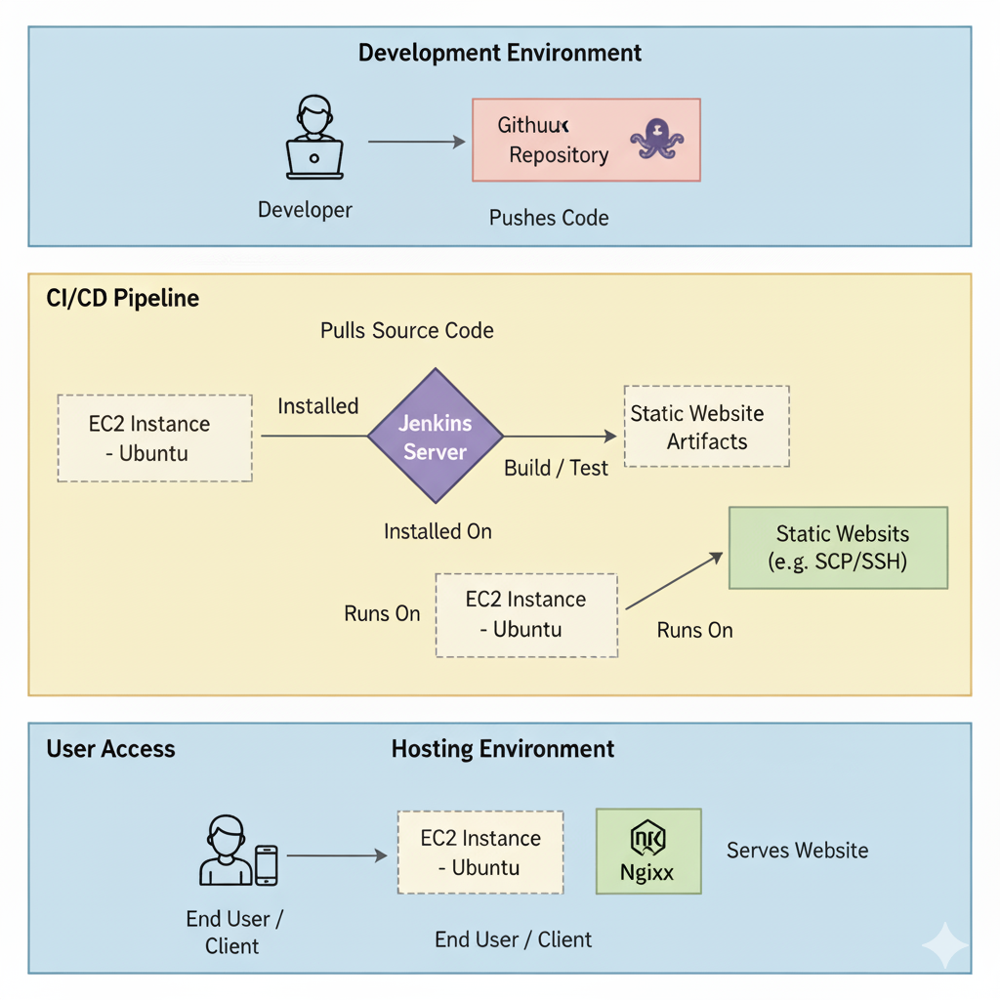
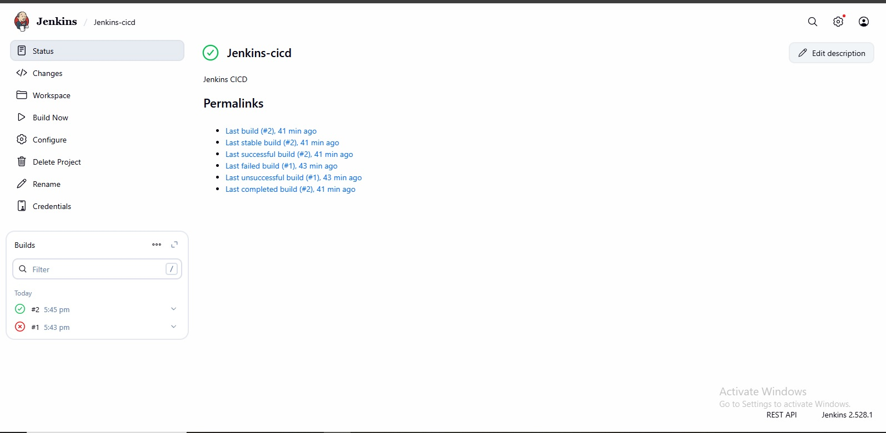

# 🚀 Jenkins CI/CD Setup and Website Hosting on AWS EC2

[](https://github.com/iam-ganeshjadhav/Jenkins-CICD)
[](https://aws.amazon.com/)
[](https://www.jenkins.io/)
[](LICENSE)

This project demonstrates how to **install, configure, and automate Jenkins** on an **AWS EC2 instance (Ubuntu)** and how to **host a static website**.  
It includes all steps — from EC2 setup, Jenkins installation, pipeline creation, and web hosting — with clear explanations.

## 📘 Table of Contents

1. [Project Overview](#project-overview)  
2. [Architecture Diagram](#architecture-diagram)  
3. [Requirements](#requirements)  
4. [Step-by-Step Setup](#step-by-step-setup)  
5. [Website Details](#website-details)  
6. [Screenshots](#screenshots)  
7. [Troubleshooting](#troubleshooting)  
8. [Useful Commands](#useful-commands)  
9. [Conclusion](#conclusion)  
10. [Author](#author)  
11. [License](#license)

## 🧩 Project Overview

This project sets up a **Jenkins CI/CD environment** on an **AWS EC2 Ubuntu instance** and hosts an **HTML-based website** that provides step-by-step Jenkins installation and setup guidance.

**Key Features:**
- Jenkins installation using official package repository  
- Configured to run as a service  
- GitHub integration for pulling website code  
- Static website hosting via Jenkins job  
- Fully automated build and deployment pipeline  

## 🏗️ Architecture Diagram



## ⚙️ Requirements

| Component | Description |
|------------|-------------|
| **OS** | Ubuntu 20.04 / 22.04 LTS |
| **Cloud** | AWS EC2 instance (t2.micro recommended) |
| **Java** | OpenJDK 11 or higher |
| **Web Port** | 8080 for Jenkins, 80 for Website |
| **Tools** | Git, Nginx, Jenkins, curl, wget |

## 🧭 Step-by-Step Setup

### 1️⃣ Launch AWS EC2 Instance
- Login to **AWS Console** → **EC2 Dashboard**  
- Click **Launch Instance**  
- Choose **Ubuntu Server 22.04 LTS**  
- Select instance type: `t2.micro` (Free Tier)  
- Configure security group:
  - Port **22 (SSH)** → Anywhere (or My IP)
  - Port **8080 (Jenkins)** → Anywhere
  - Port **80 (HTTP)** → Anywhere
- Launch instance and download `.pem` key

### 2️⃣ Connect via SSH
```bash
chmod 400 your-key.pem
ssh -i your-key.pem ubuntu@<ec2-public-ip>
```

### 3️⃣ Update System and Install Java
```bash
sudo apt update
sudo apt install -y openjdk-11-jdk
java -version
```

### 4️⃣ Install Jenkins
```bash
wget -q -O - https://pkg.jenkins.io/debian-stable/jenkins.io.key | sudo gpg --dearmor -o /usr/share/keyrings/jenkins-keyring.gpg
echo "deb [signed-by=/usr/share/keyrings/jenkins-keyring.gpg] https://pkg.jenkins.io/debian-stable binary/" | sudo tee /etc/apt/sources.list.d/jenkins.list > /dev/null
sudo apt update
sudo apt install -y jenkins
```

### 5️⃣ Start and Enable Jenkins
```bash
sudo systemctl enable --now jenkins
sudo systemctl status jenkins
```

### 6️⃣ Configure Jenkins via Web UI
1. Copy the initial admin password:
   ```bash
   sudo cat /var/lib/jenkins/secrets/initialAdminPassword
   ```
2. Paste it in Jenkins UI (Unlock Jenkins)
3. Install **Suggested Plugins**
4. Create your **Admin User**
5. Continue to Jenkins Dashboard

### 7️⃣ Setup Git and Clone Repository
```bash
sudo apt install git -y
git --version
git clone https://github.com/iam-ganeshjadhav/Jenkins-CICD.git
```

### 8️⃣ Create Jenkins Job
1. Go to Jenkins Dashboard → **New Item**
2. Select **Freestyle Project**
3. Enter name (e.g., `Jenkins-CICD`)
4. Under **Source Code Management** → Choose **Git**
   Repository URL: `https://github.com/iam-ganeshjadhav/Jenkins-CICD.git`
5. Under **Build Steps** → Choose **Execute Shell**
```bash
sudo cp -r * /var/www/html/
```
6. Click **Save** → **Build Now**  
7. If permissions error occurs:
```bash
sudo chmod -R 777 /var/www/html/
```

### 9️⃣ Deploy Static Website
Visit: `http://<your-ec2-public-ip>/` to see your **Jenkins Installation Guide Website** live.

## 🌐 Website Details
- Step-by-step Jenkins installation guide for Ubuntu, RHEL, Windows, macOS, Docker
- Copy buttons for commands
- Stylish gradients and responsive design
- Troubleshooting and security notes

## 🌐 Used Code For the Wesite
[Website Code ](code.html)


## 🖼️ Screenshots



## 🧰 Troubleshooting
| Issue | Possible Fix |
|-------|--------------|
| Jenkins not starting | Check Java version with `java -version` |
| Port 8080 blocked | Update AWS security group rules |
| Permission denied | Use `sudo chmod -R 777 /var/www/html/` |
| Wrong admin password | `sudo cat /var/lib/jenkins/secrets/initialAdminPassword` |
| Git fetch failed | Verify repo URL or branch name |

## 🧩 Useful Commands
```bash
sudo systemctl status jenkins
sudo systemctl restart jenkins
sudo journalctl -u jenkins -f
sudo systemctl stop jenkins
sudo apt remove --purge jenkins -y
```

## 🏁 Conclusion
Complete Jenkins CI/CD setup on AWS EC2 with automated static website deployment. Ideal for learning **DevOps**, **CI/CD**, and **AWS automation**.

## 👨‍💻 Author
**Ganesh Jadhav**  
BCA (Information Technology)  
📧 [Email Me](jadhavg9370@gmail.com)  
🌐 [GitHub Profile](https://github.com/iam-ganeshjadhav)

## 🏷️ License
Open-source, free for educational purposes.

